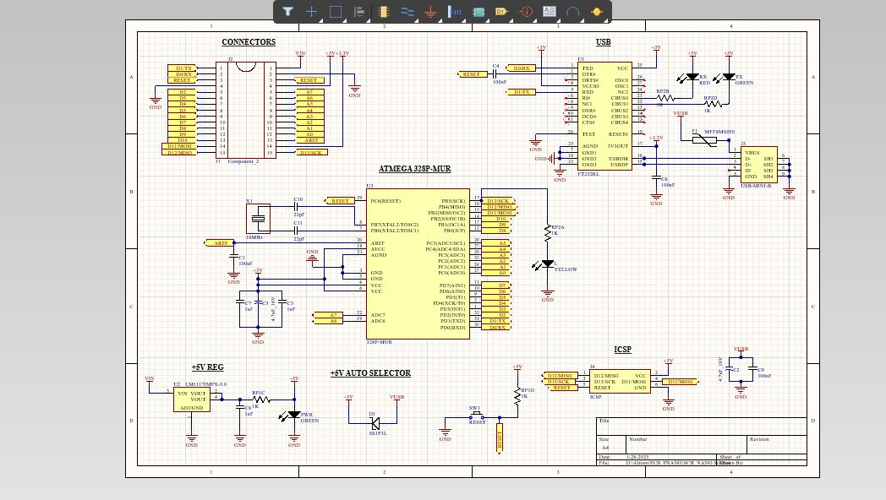
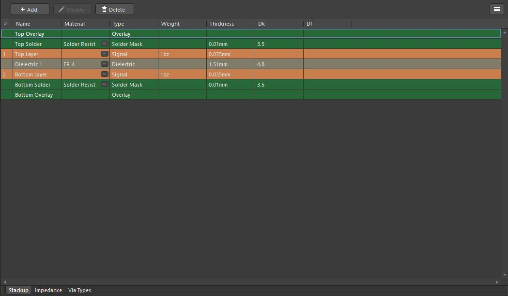
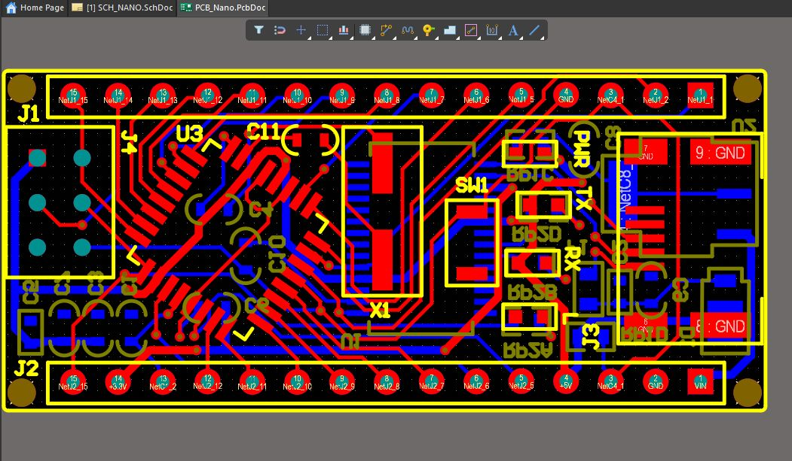
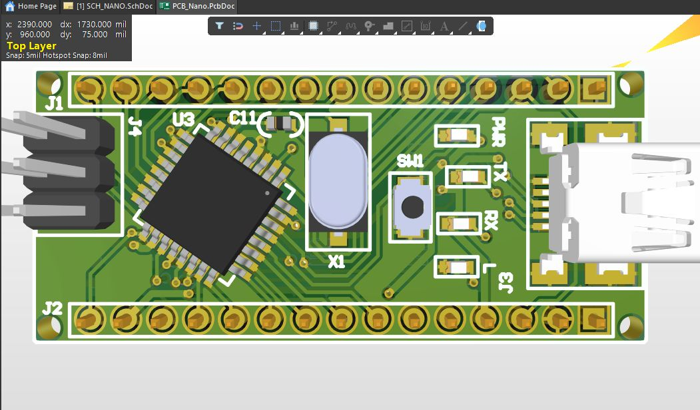
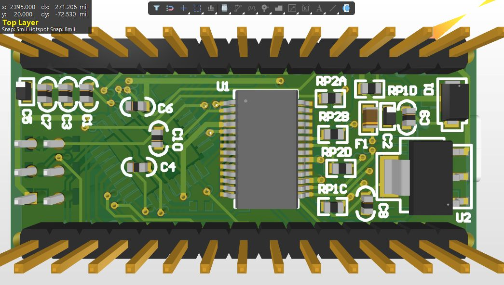

# 🔧 Arduino-Nano-Compatible-PCB-Design

## 📌 Project Overview
This repository contains the **schematic and PCB layout design** of an **Arduino Nano–compatible development board**. The project focuses purely on **PCB design practices**, including schematic capture, component footprint selection, 2-layer PCB layout, and layer stackup definition using professional EDA tools. No firmware development or physical hardware assembly was performed as part of this project.

## 🎯 Project Objectives
- Design a complete Arduino Nano–compatible schematic  
- Apply correct component selection and pin mapping  
- Create a manufacturable **2-layer PCB layout**  
- Understand PCB stackup, routing, and layout best practices  
- Gain hands-on experience with professional PCB design workflows  

## 🛠️ Design Scope
✔ Schematic design  
✔ PCB layout (2-layer)  
✔ Layer stackup definition  
✔ 2D and 3D PCB visualization  

## 🧰 Tools Used
- **PCB Design Tool:** Altium Designer  
- **Board Type:** 2-layer FR-4 PCB  

## 🧩 Schematic Design
The schematic includes:
- Arduino Nano–compatible MCU connections  
- Power input and basic regulation circuitry  
- Decoupling capacitors and supporting components  
- I/O header pin mapping  

## 🧱 PCB Layout Details
- 2-layer PCB (Top & Bottom layers)  
- Optimized component placement for compact layout  
- Manual routing with clear signal organization  
- Ground plane implementation  
- Design Rule Check (DRC) verified  

## 📚 Layer Stackup
- Top Layer: Signal  
- Dielectric: FR-4  
- Bottom Layer: Signal  
- Solder mask applied on both layers  

## ✅ Key Learnings
- Schematic-to-PCB workflow  
- Component footprint selection  
- 2-layer PCB routing techniques  
- PCB stackup understanding  
- Professional documentation of PCB designs  

## 🚀 Future Improvements
- Convert the design into a fabricated PCB  
- Add USB-to-Serial interface  
- Improve layout optimization and EMI performance  
- Extend the design with additional peripherals  

## 📷 Project Preview

### Schematic

### Layer Stackup

### 2D PCB Layout

### 3D PCB Layout

## 📄 License
This project is intended for **educational and learning purposes**.
